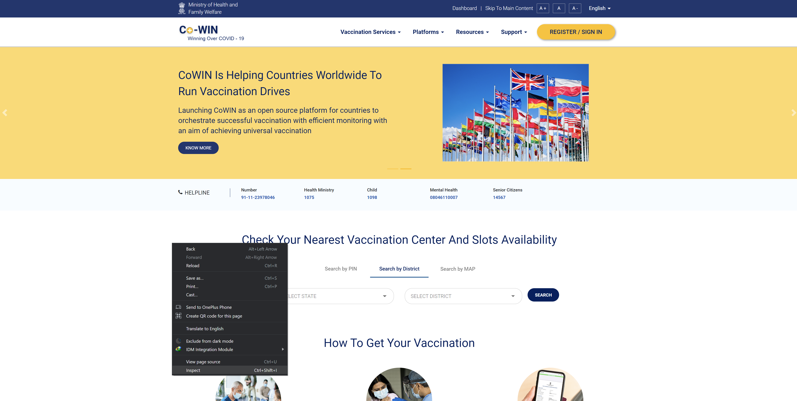
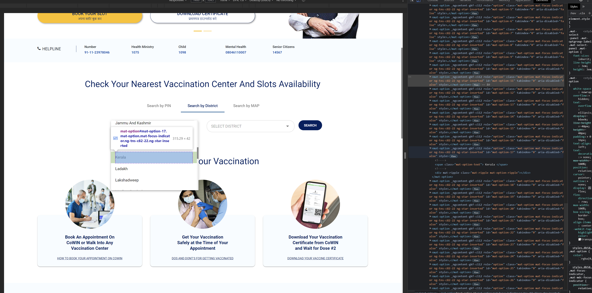
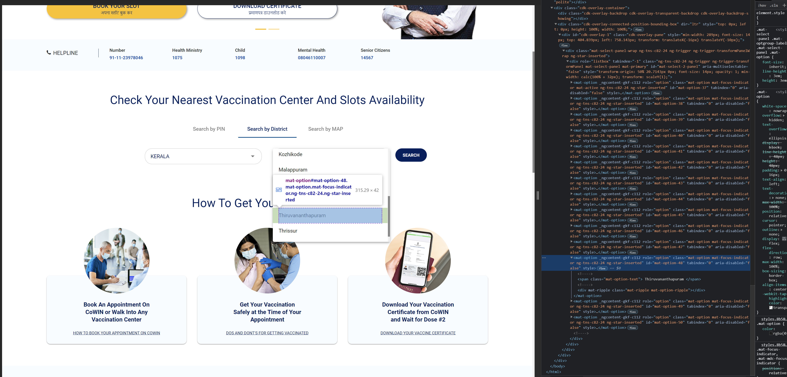

<h1 align="center">
  
  Cowin Scrape
</h1>
<p align="center">Get the list of all latest vaccine informarion near you from <b>Cowin India Website</b> (https://www.cowin.gov.in/)</p>

<p align="center">
<a href="https://github.com/create-go-app/cli/releases" target="_blank">
    
</a>&nbsp;
<a href="https://pkg.go.dev/github.com/create-go-app/cli/v2?tab=doc" target="_blank">
    
</a>&nbsp;
<a href="https://gocover.io/github.com/create-go-app/cli/pkg/cgapp" target="_blank">
    
</a>&nbsp;
<a href="https://goreportcard.com/report/github.com/create-go-app/cli" target="_blank">
    
</a>&nbsp;

</p>

## ⚡️ Quick start

First of all, download and install [Python](https://www.python.org/downloads/) and your favourite IDE (I used [PyCharm](https://www.jetbrains.com/pycharm/download/#section=windows)) and install the packages given in the **[requirements.txt](requiremts.txt)** file. Python Version `3.6` or higher is required.

Package installation can be done by using the [`pip install`](https://www.geeksforgeeks.org/how-to-install-pip-on-windows/) command:

```bash
pip install -r requirements.txt
```

Also, macOS and Linux users can check here to see [`pip install`](https://www.geeksforgeeks.org/how-to-install-pip-in-macos):

<br>

**Note** : It is recommended to create a virtual environment and install your packages inside the virtual environment

```bash
# Installing virtualenv
pip install virtualenv

# Creating virtual environment folder:
virtualenv venv


# Activating environment

# Windows
venv\Scripts\activate
# Mac / Linux:
venv/bin/activate

# Finally installing packages inside environment
pip install -r requirements.txt
```

<br>

Let's check your **Cowin Scrape variables**. Open [cowin_scrape.py](cowin_scrape.py)
```bash
clickDistOption = ""
clickStateSelect = ""
selectStateTarget = ""
clickDistrictSelect = ""
selectDistrictTarget = ""
searchBtn = ""


def init_var():
    global clickDistOption, clickStateSelect, selectStateTarget, clickDistrictSelect, selectDistrictTarget, searchBtn
    # initialising Cowin Variables
    clickDistOption = '//div[@id="mat-tab-label-0-1"]'
    clickStateSelect = '//span[@class="mat-select-placeholder mat-select-min-line ng-tns-c82-22 ng-star-inserted"]'
    selectStateTarget = '//mat-option[@id="mat-option-17"]'
    clickDistrictSelect = '//span[@class="mat-select-placeholder mat-select-min-line ng-tns-c82-24 ng-star-inserted"]'
    selectDistrictTarget = '//mat-option[@id="mat-option-48"]'
    searchBtn = '//button[@class="searchBtn pin-search-btn district-search"]'
```

As you can see, we need 6 variables.
| #      | Variable                    | Type     | Default                                                                                                 | Description                                  |
| ------ | --------------------------- | -------- | ------------------------------------------------------------------------------------------------------- | -------------------------------------------- |
| `1.`   | `clickDistOption`             | `string` |  '//div[@id="mat-tab-label-0-1"]'                                                                       |   To click "Search by District" option.      |
| `2.`   | `clickStateSelect`            | `string` |  '//span[@class="mat-select-placeholder mat-select-min-line ng-tns-c82-22 ng-star-inserted"]'           |   To click State dropdown menu.              |
| `3.`   | `selectStateTarget`           | `string` |  '//mat-option[@id="mat-option-17"]' ( value for Kerala )                                               |   To select State from the dropdown menu.    |
| `4.`   | `clickDistrictSelect`         | `string` |  '//span[@class="mat-select-placeholder mat-select-min-line ng-tns-c82-24 ng-star-inserted"]'           |   To click District dropdown menu.           |
| `5.`   | `selectDistrictTarget`        | `string` |  '//mat-option[@id="mat-option-48"]' ( value for Thiruvananthapuram )                                   |   To select State from the dropdown menu.    |
| `6.`   | `searchBtn`                   | `string` |  '//button[@class="searchBtn pin-search-btn district-search"]'                                          |   To click "SEARCH" button.                  |

<br>

Next, open Cowin Website ([`https://www.cowin.gov.in/`](https://www.cowin.gov.in/)) and fill in the variables according to respective state and district. Only Variables `selectStateTarget`, `selectDistrictTarget` are required to be changed.

**Step 1**: Inspect the website:
<p align="center"><br/></p>

**Step 2**: Find your state and get the mat-option id:
<p align="center"><br/></p>

**Step 3**: Find your district and get the mat-option id:
<p align="center"><br/></p>

**Step 4**: After getting both state mat-option id and district mat-option id, pass it to the variables `selectStateTarget`, `selectDistrictTarget`
```bash
clickDistOption = ""
clickStateSelect = ""
selectStateTarget = ""
clickDistrictSelect = ""
selectDistrictTarget = ""
searchBtn = ""


def init_var():
    global clickDistOption, clickStateSelect, selectStateTarget, clickDistrictSelect, selectDistrictTarget, searchBtn
    # initialising Cowin Variables
    clickDistOption = '//div[@id="mat-tab-label-0-1"]'
    clickStateSelect = '//span[@class="mat-select-placeholder mat-select-min-line ng-tns-c82-22 ng-star-inserted"]'
    # Add State variable
    selectStateTarget = '//mat-option[@id="YOUR_STATE_MAT-OPTION_ID"]'
    clickDistrictSelect = '//span[@class="mat-select-placeholder mat-select-min-line ng-tns-c82-24 ng-star-inserted"]'
    # Add District variable
    selectDistrictTarget = '//mat-option[@id="YOUR_DISTRICT_MAT-OPTION_ID"]'
    searchBtn = '//button[@class="searchBtn pin-search-btn district-search"]'
```

That's all you need to do to start! 🎉

<br>

### 🚚 Get the list of all vaccines

If you basically need just the number of vaccines and its details from the website, run [main.py](main.py)

```bash
python main.py
```

> 🔔 Please note: You can create your own custom project from [main.py](main.py). Like getting vaccines from age group `18+` or get the details of only `SPUTNIK V` vaccine etc... <br> Such an example program can be found in [noisy_alert.py](noisy_alert.py) where it finds `COVISHIELD` and `SPUTNIK V` vaccines for the age group `18+`.

<br>

### 🚚 Get alert if a vaccine is available

[noisy_alert.py](noisy_alert.py) finds `COVISHIELD` and `SPUTNIK V` vaccines for the age group `18+` and starts playing sound (audio2.mp3) if a vaccine slot was available.

```bash
python noisy_alert.py
```

<br>

## ⭐️ Project assistance

If you want to say **thank you** or/and support active development of `Cowin-Scrape`:

- Add a [GitHub Star](https://github.com/Abhijith14/Cowin-Scrape) to the project.
- Tweet about this project [on your Twitter](https://twitter.com/intent/tweet?text=%E2%9C%A8%20Find%20Your%20Nearest%20Vaccination%20Center%20And%20Slots%20Availability%20using%20Cowin-Scrape.%20A%20Web%20Scraping%20project%20done%20using%20%23Python%20for%20%23Cowin%20%23India.%20%0A%0A%2B%20Faster%20%0A%2B%20User-Customizable%20%0A%2B%20Notification-Support%20%0A%0AJust%20Enter%20your%20State%20and%20District,%20%0ACowin-Scrape%20will%20take%20care%20of%20the%20rest.%0A%0Ahttps%3A%2F%2Fgithub.com%2FAbhijith14%2FCowin-Scrape).
- Write interesting articles about project on [Dev.to](https://dev.to/), [Medium](https://medium.com/) or personal blog.

Together, we can make this project **better** every day! 😘

<br>

### 🛠️ Built With

* [Python 3.8](https://www.python.org/) - Creating Project


### ❤️ Authors

* **Abhijith Udayakumar** - *Design & Development* - [Abhijith14](https://github.com/Abhijith14)

<br>
<br>

## 🚨 Forking this repo (please read!)

_**yes, with attribution**_.

I value keeping my work open source, but as you all know, _**plagiarism is bad**_. It's always disheartening whenever I find that someone has copied my work without giving me credit. I spent a non-trivial amount of effort building and designing this project, and I am proud of it! All I ask of you all is to not claim this effort as your own.


### TL;DR

Yes, you can fork this repo. Please give me proper credit by linking back to [Abhijith14/Cowin-ScrapeL](https://github.com/Abhijith14/Cowin-Scrape). Thanks!